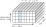

## 


<a href="https://arxiv.org/abs/2406.05816"></a>

## Compositionality


- The world is compositional or at least our model of it is
  - [Vision](): Scenes made from objects, objects made from parts
  - [Language](): Compositions of words according to grammatical rules
  - [Tasks](): Complex behaviours can be decomposed into simpler skills


> Compositionality fuels a **combinatorial explosion**. How do <s>neural networks</s> transformers generalize to compositions not seen during training? 


<!-- - Why use multiple heads in the attention mechanism? Why not use more depth/width instead? -->


# <font color="#ffffff"> Multi-head attention is a hypernetwork </font> {data-background=#08407E}

## Hypernetwork

A hypernetwork is a neural network that reconfigures <br> the computation of another neural network.


## Multi-head attention

> Multi-head attention is a linear hypernetwork with a linear value network.

Given the attention scores $\mathbf{\mathcal{A}} = \sigma \bigl ( \; \left[\mathbf{\mathrm{\tilde{A}}}_1 \; \mathbf{\mathrm{\tilde{A}}}_2 \; \ldots \; \mathbf{\mathrm{\tilde{A}}}_H \right] \; \bigr ) \text{ with } \mathbf{\mathrm{\tilde{A}}}_h =  \frac{\mathbf{\mathrm{Q}}_h \mathbf{\mathrm{K}}_h^\top}{\sqrt{D^{\text{key}}}}$ <br> and $\sigma(\cdot)=\mathrm{Softmax}(\cdot)$, multi-head attention can be reformulated as follows:

$$
\begin{aligned}
\text{MHA}_{q}(\mathbf{\mathrm{X}})
:=& \mathbf{W}^{\text{out}} \bigoplus_{h=1}^H \sum_{k=1}^T a_{h,q,k} \; \mathbf{W}^{\text{value}}_h \mathbf{x}_k \\
=& \sum_{h=1}^H \mathbf{W}^{\text{out}}_h \sum_{k=1}^T a_{h,q,k} \; \mathbf{W}^{\text{value}}_h \mathbf{x}_k \\
=& \sum_{k=1}^T \left(\sum_{h=1}^H \underbrace{a_{h,q,k}}_{\text{latent code}} \; \underbrace{\mathbf{W}^{\text{out}}_h \mathbf{W}^{\text{value}}_h}_{\text{hypernetwork}} \right) \mathbf{x}_k  \\
=& \sum_{k=1}^T \underbrace{\mathbf{\mathrm{W}}_{q,k}}_{\text{value network}} \mathbf{x}_k
\end{aligned}
$$


## Multi-head attention

> Multi-head attention can be viewed as a linear hypernetwork with a linear value network.


## Attention as a hypernetwork

What are the implications of this perspective? 

:::::::::::::: {.columns}
::: {.column width="50%"}

- The attention scores along the head index represent a **latent code** that specifies the _operation_ applied to each key-query pair
- Through these latent codes, operations could be shared across known tasks and reused for unknown tasks
-  Making the value network more _expressive_ could strengthen the ability to reuse operations

:::
::: {.column width="50%"}

<!--  -->
:::
::::::::::::::


# <font color="#ffffff"> Hypernetwork linear attention </font> {data-background=#08407E}

## Hypernetwork linear attention (HYLA)

We reinforce the hypernetwork mechanism of multi-head attention by <br> making the **value network nonlinear**.

- We do not introduce additional parameters
- We normalize attention scores across the head indices using $\sigma(\cdot)=\mathrm{RMSNorm}(\cdot)$

$$
\begin{aligned}
\text{HYLA}_{q}(\mathbf{\mathrm{X}})
=& \sum_{k=1}^T \left(\sum_{h=1}^H a_{h,q,k} \; \mathbf{W}^{\text{out}}_h  \right) \phi \left ( \sum_{h=1}^H a_{h,q,k} \; \mathbf{W}^{\text{value}}_h \mathbf{x}_k \right ) \\
=& \sum_{k=1}^T \mathbf{\mathrm{W}}'_{q,k} \phi (\mathbf{\mathrm{W}}_{q,k} \mathbf{x}_k)
\end{aligned}
$$

<!-- $$
\text{RMSNorm}(\mathbf{x})=\frac{\mathbf{x}}{\sqrt{\frac{1}{n}\sum_{i=1}^{n}x_{i}^{2}}}
$$ -->

## Comparison to standard MHA


# <font color="#ffffff"> Symbolic Raven matrices </font> {data-background=#08407E}

## Raven progressive matrices

A non-verbal test to measure general human intelligence and abstract reasoning.^[Carpenter et al. (1990). What one intelligence test measures: a theoretical account of the processing in the Raven Progressive Matrices Test.] ^[Raven (1962). Advanced Progressive Matrices.]


<aside class="notes">

Subjects initially assume that the rectangles correspond to each other, the dark curves correspond to each other and the straight lines correspond to each other. But to solve the problem, subjects must backtrack and try other possible bases for correspondence, such as numerosity or orientation.

</aside>


## Symbolic Raven (sraven)

A Raven-inspired benchmark to measure compositional generalization for abstract reasoning.


## Finding correspondences

We model one of the key difficulties of _finding correspondences_ by applying a fixed permutation to each column.


## Compositional generalization

Strengthening the hypernetwork mechanism improves compositional generalization.


## Compositional generalization II

Weakening the hypernetwork mechanism disrupts compositional generalization.


## Latent code structure I

The hypernetwork latent code is highly structured.


## Latent code structure II

We can decode the operation a layer implements on OOD tasks.


## Model ablations

Is it really the hypernetwork mechanism of HYLA that improves performance?


# <font color="#ffffff"> What's next? </font> {data-background=#08407E}


## Language modelling

HYLA works comparably well on autoregressive language modelling, <br> despite being a linear attention method (50M parameters, 130B tokens).


<aside class="notes">

```
cfg.model = (
  D=512,  # model/embed dim  = qkv dim
  H=8,  # num attention heads
  L=512,  # max context/sequence length (move out of config?)
  N=6,  # number of transformer block layers
  F=2048,  # FF inner dimension
  dtype="bfloat16",  # computation dtype.
)
```

</aside>


## Open questions

- Can we understand transformer-based foundation models from this perspective?
- Should we be using more hyla? Combine it with softmax attention?
